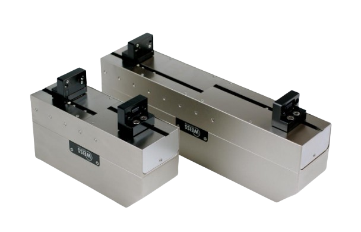

# ROS Package for Schunk WSG-50 Gripper

Forked from: [https://github.com/nalt/wsg50-ros-pkg](https://github.com/nalt/wsg50-ros-pkg)



## Overview of Updates in this Repository

This repository introduces a complete redesign of the WSG-50 gripper driver to align with ROS 2 standards, ensuring better integration, improved robustness, and modernized communication mechanisms.


## Installation
Follow the steps below to set up packages.

Clone the prl repository into your ROS 2 workspace:
```bash
cd ~/ws/src
git clone git@github.com:inria-paris-robotics-lab/wsg50-ros-pkg.git
```

After you had installed all dependencies you can build every packages with 'colcon':
```bash
cd ~/ws
colcon build --symlink-install 
```

## Usage
**Note**: The following instructions are intended for standalone usage of the gripper.
### Simulate hardware
---

Below are instructions for standalone use of the WSG-50 gripper:

#### Visualize the URDF File
To visualize the URDF file of the WSG-50 gripper, use the following command:
```bash
ros2 launch wsg_50_simulation view_wsg50.launch.py
```
#### Launch Simulation
To simulate the WSG-50 gripper in a standalone environment, use:
```bash
ros2 launch wsg_50_simulation wsg_50.launch.py
```

#### Launch the ROS 2 Node Driver with a Real Gripper
To connect and control a real WSG-50 gripper, launch the ROS 2 node driver:
```bash
ros2 launch wsg_50_driver wsg_50_driver.launch.py ip:=<gripper_ip> port:=<gripper_port>
```
### Real Hardware
---

The following parameters are declared in the driver and can be customized as needed to match your gripper's configuration:

- **`ip`**: The IP address of the gripper. Default: `"192.168.1.20"`.
- **`port`**: The port number used to communicate with the gripper. Default: `1000`.
- **`local_port`**: The local port on the host machine for outgoing communication. Default: `1501`.
- **`protocol`**: The communication protocol. Default: `"tcp"`.
- **`rate`**: The update rate in Hz for communication with the gripper. Default: `100.0`.  
    *Warning*: If the rate is too low, the driver may not function properly.
- **`grasping_force`**: The maximum force (in Newtons) applied when grasping an object. Default: `5.0`.
- **`finger_sensors`**: Enables or disables the gripper's finger sensors. Default: `false`.

Ensure these parameters are correctly set to optimize the gripper's performance and compatibility with your setup.

#### Launch Visualization and Control with ROS 2 Control
To visualize and control the gripper using ROS 2 Control, launch the following:
```bash
ros2 launch wsg_50_driver wsg_50_control.launch.py
```

## ROS 2 Control Integration

A new hardware interface (`WSG50HardwareInterface`) has been implemented, enabling seamless integration with ROS 2 Control. Key features include:

- **State Interfaces**: Publish real-time gripper data (position, speed, force).
- **Command Interfaces**: Allow asynchronous control of the gripper's target position.

### Core Methods
- **on_init**: Initializes the gripper using parameters from the URDF.
- **on_activate**: Connects and configures the gripper for use.
- **export_state_interfaces**: Exposes state variables (position, speed, force) to ROS 2 Control.
- **export_command_interfaces**: Exposes command variables (target position).
- **write**: Sends commands to the gripper, determining the mode (`grasp` or `release`) based on the target position.

---

## Node: `wsg_50_driver`

### Parameters
- `ip`: Gripper's IP address.
- `port`: Gripper's port.
- `protocol`: Communication protocol.
- `rate`: Update rate in Hz.
- `grasping_force`: Force limit for grasping.

### Topics

- `/state`: Gripper state (position, speed, force).
- `/joint_states`: Standard joint state message.
- `/moving`: Indicates if the gripper is in motion.

### Services
- `set_force`, `set_acc`: Adjust force or acceleration.
- `homing`, `do_tare`, `stop`, `ack`: Configuration and error recovery.

### Action Server: `/gripper_cmd`

The action server `/gripper_cmd` is the primary interface for controlling the WSG-50 gripper. It supports the following commands:

- **Move**: Moves the gripper to a specified position.
- **Grasp**: Grasps an object with a specified force.
- **Release**: Releases the object and opens the gripper.

#### Action Definition
The action server uses a custom action definition with the following structure:

- **Goal**:
    - `mode` (int): Command mode: 0: Move, 1: Grasp, 2: Release
    - `position` (float): Target position for the gripper in millimeters.
    - `speed` (float): Speed of movement in millimeters per second.

- **Feedback**:
    - `position` (float): Current position of the gripper.

- **Result**:
    - `result` (bool): Indicates whether the command was successfully executed.

---

## ROS 2 Control Interface Configuration

Below is an example configuration for integrating the WSG-50 gripper with ROS 2 Control in a URDF file:

```xml
<hardware>
    <plugin>wsg_50_interface::WSG50HardwareInterface</plugin>
    <param name="gripper_name">wsg</param>
    <param name="ip_address">192.168.1.20</param>
    <param name="port">1000</param>
    <param name="protocol">tcp</param>
    <param name="local_port">1501</param>
    <param name="rate">100.0</param>
    <param name="grasping_force">10.0</param>
    <param name="speed">20.</param>
    <param name="finger_sensors">true</param>
</hardware>
<joint name="${prefix}_width_joint">
    <command_interface name="position"/>
    <state_interface name="position"/>
    <state_interface name="velocity"/>
    <state_interface name="effort"/>
</joint>
```

### Explanation of Configuration Parameters

- `plugin`: Specifies the hardware interface plugin to use. In this case, it’s the `WSG50HardwareInterface`, which provides the necessary functionality to control the WSG-50 gripper.
- `gripper_name`: A user-defined name for the gripper. This is used to identify the gripper in the system.
- `ip_address`: The IP address of the WSG-50 gripper. This is used to establish a connection with the gripper over the network.
- `port`: The port number on the gripper to which the system connects. The default port for the WSG-50 is typically `1000`.
- `protocol`: Specifies the communication protocol. The WSG-50 gripper uses `TCP` (Transmission Control Protocol) for reliable communication.
- `local_port`: The local port on the host machine used for the connection. This is optional and can be used to specify a fixed port for outgoing communication.
- `rate`: The update rate in Hz for communication with the gripper. This determines how frequently the system sends commands and receives feedback.
- `grasping_force`: The maximum force (in Newtons) that the gripper will apply when grasping an object. This helps prevent damage to delicate objects.
- `speed`: The speed (in mm/s) at which the gripper moves. This controls how quickly the gripper opens or closes.
- `finger_sensors`: A boolean value indicating whether the gripper’s finger sensors are enabled. These sensors can provide more precise effort feedback.

